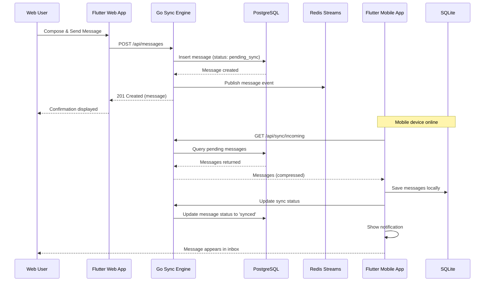
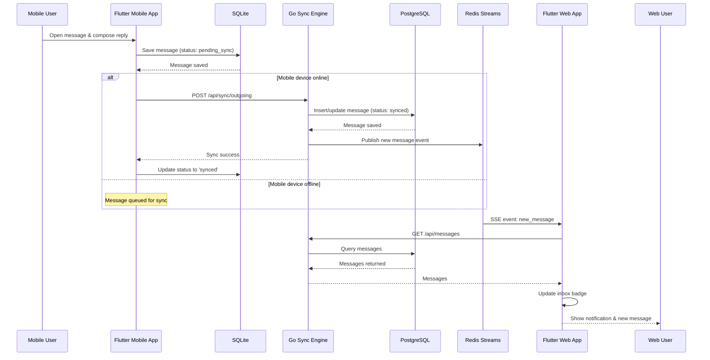
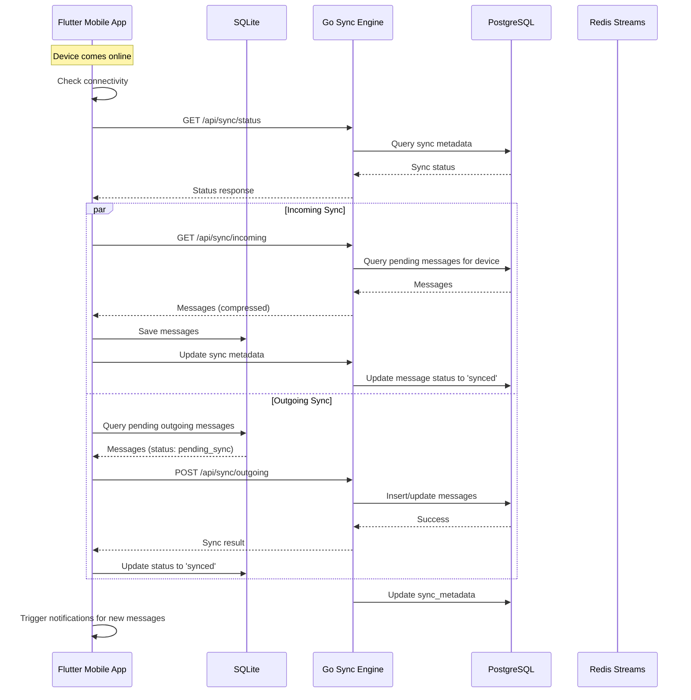
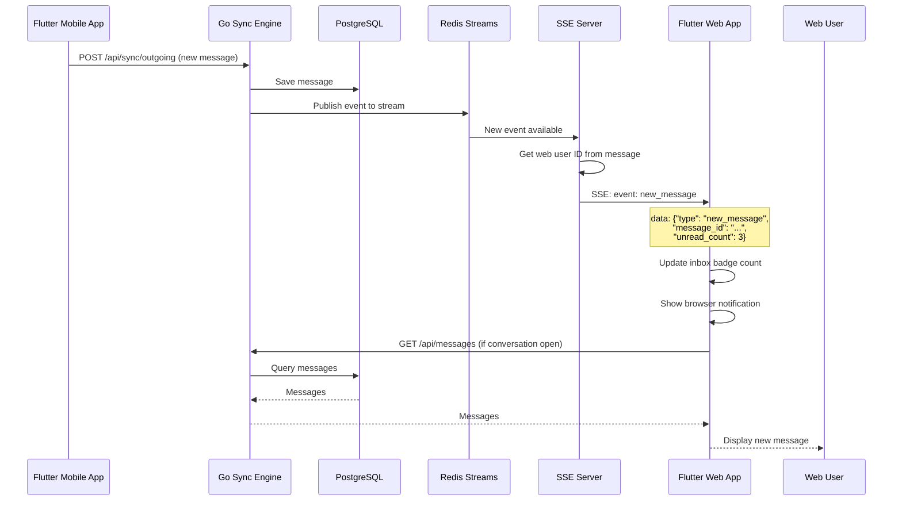
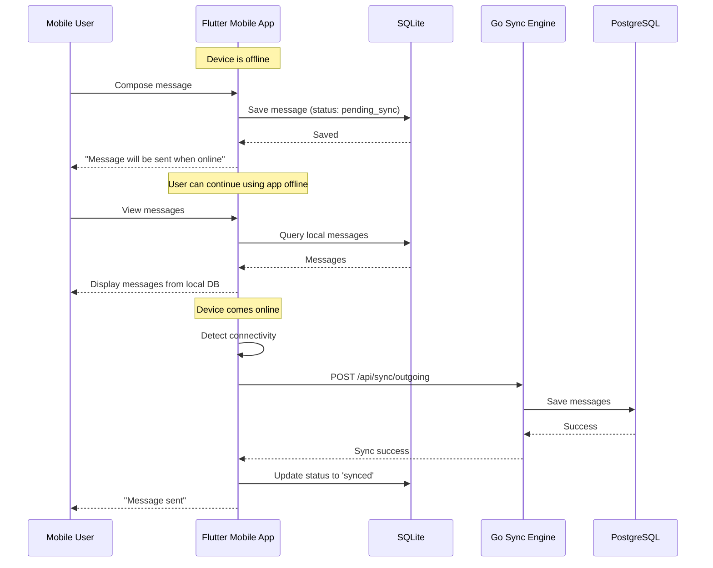
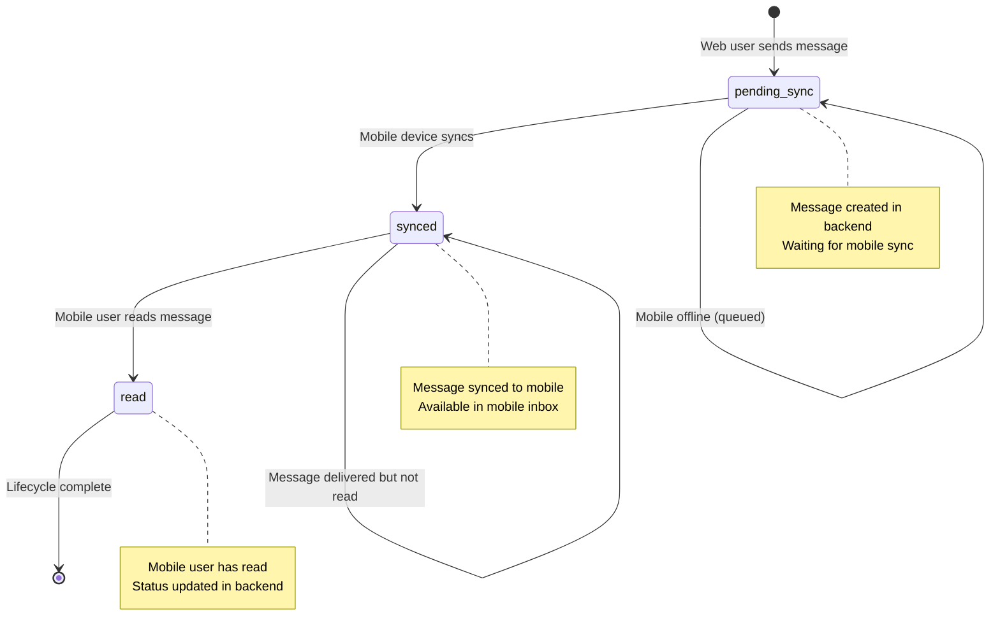
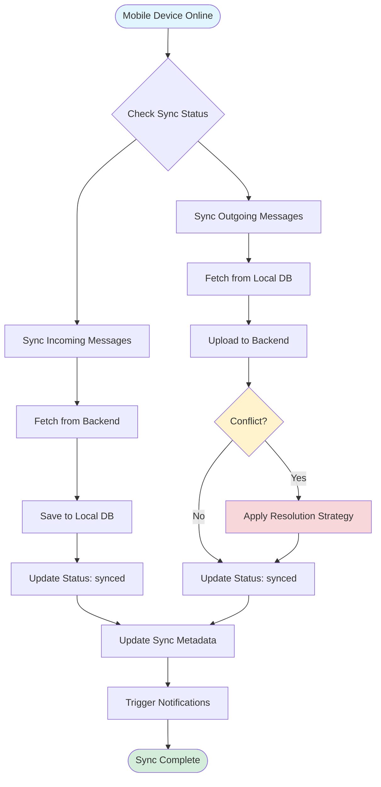
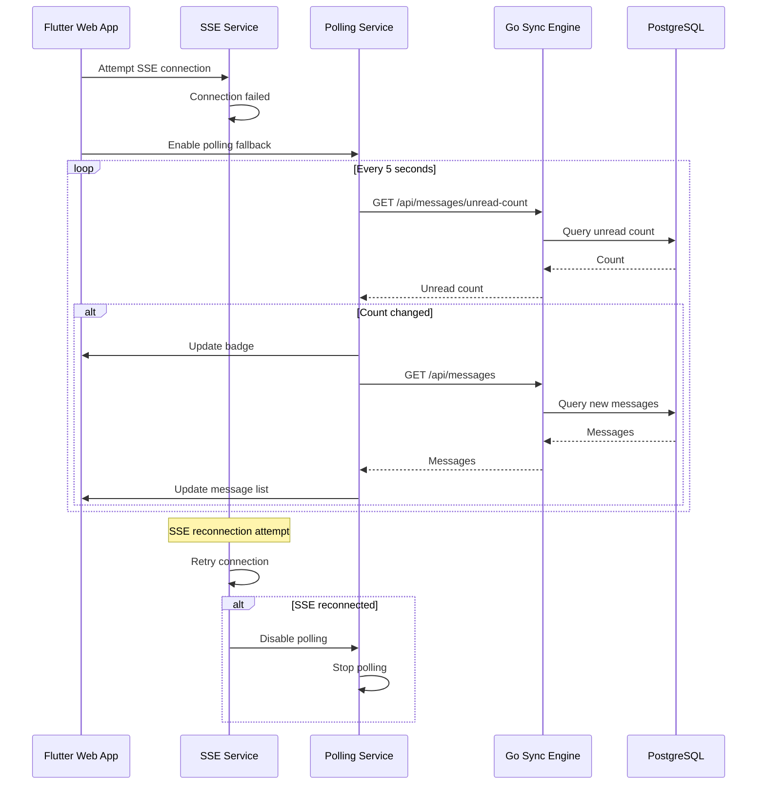
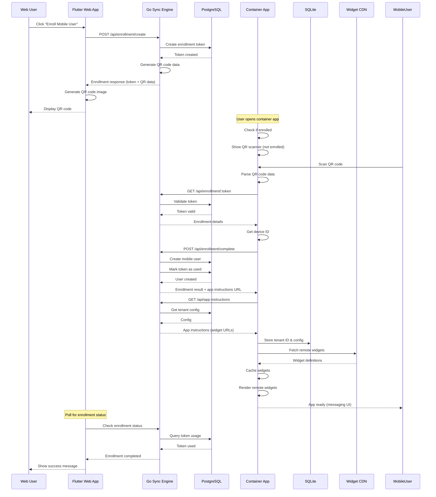
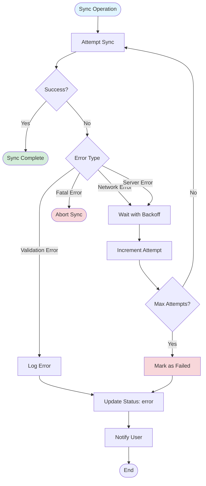

# Data Flow Diagrams

This document contains mermaid diagrams illustrating the key data flows in the Posduif messaging application.

## Message Send Flow (Web → Mobile)

This diagram shows the complete flow when a web user sends a message to a mobile user.

## Message Reply Flow (Mobile → Web)

This diagram shows the flow when a mobile user replies to a message.

## Sync Process Flow

This diagram shows the bidirectional synchronization process when a mobile device comes online.

## Real-Time Notification Flow

This diagram shows how real-time notifications are delivered to web users via SSE.

## Offline Message Handling Flow

This diagram shows how messages are handled when the mobile device is offline.

## Message Status Lifecycle

This diagram shows how message status changes throughout its lifecycle.

## Bidirectional Sync Flow

This diagram shows the complete bidirectional sync process with conflict handling.

## Web User Polling Fallback Flow

This diagram shows the polling fallback mechanism when SSE is unavailable.

## QR Code Enrollment Flow

This diagram shows the complete enrollment flow from web user generating QR code to mobile app being ready for use.

## Error Handling and Retry Flow

This diagram shows how errors are handled and retried during sync operations.

