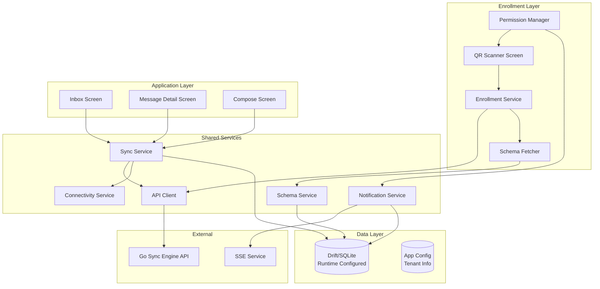

# Flutter Mobile Application Specification

## Overview

The Flutter mobile application is an offline-first messaging client that uses runtime schema configuration. The app handles all permissions, QR code scanning for enrollment, and fetches the database schema from the backend during enrollment. It uses Drift (SQLite) as the primary database, configuring tables dynamically at runtime based on the schema fetched from the backend. The app provides seamless messaging functionality with background synchronization when the device is online.

## Architecture

The mobile app uses a schema-driven architecture:

1. **Enrollment Layer**: Handles QR code scanning, enrollment, and schema fetching
2. **Database Layer**: Drift ORM configured dynamically at runtime using fetched schema
3. **Application Layer**: Messaging UI and business logic using the configured database



## Project Structure

```
lib/
├── main.dart                    # App entry point
├── app.dart                     # App widget with providers
│
├── features/                    # Feature Modules
│   ├── enrollment/
│   │   ├── screens/
│   │   │   └── qr_scanner_screen.dart # QR scanner for enrollment
│   │   └── services/
│   │       └── enrollment_service.dart # Enrollment logic
│   ├── messaging/
│   │   ├── screens/
│   │   │   ├── inbox_screen.dart   # Message inbox
│   │   │   ├── message_detail_screen.dart # Message view
│   │   │   └── compose_screen.dart # Compose message
│   │   └── widgets/
│   │       ├── message_list_item.dart # Message list item
│   │       ├── message_bubble.dart    # Message bubble
│   │       └── offline_indicator.dart # Offline indicator
│   └── permissions/
│       └── permission_service.dart # Permission management
│
├── core/                        # Core Services & Models
│   ├── models/
│   │   ├── user.dart           # User model
│   │   ├── message.dart        # Message model
│   │   ├── sync_status.dart    # Sync status model
│   │   ├── enrollment.dart     # Enrollment model
│   │   └── schema.dart         # Schema definition model
│   │
│   ├── database/
│   │   ├── app_database.dart   # Drift database definition
│   │   ├── schema_config.dart  # Runtime schema configuration
│   │   └── migrations/
│   │       └── migration_1.dart # Database migrations
│   │
│   └── services/
│       ├── sync_service.dart    # Bidirectional sync logic
│       ├── api_client.dart      # HTTP API client
│       ├── notification_service.dart # Push notifications
│       ├── connectivity_service.dart # Network connectivity
│       ├── device_service.dart  # Device ID management
│       └── schema_service.dart  # Schema fetching and configuration
│
└── utils/
    ├── constants.dart           # App constants
    └── helpers.dart             # Helper functions
```

## Data Models (Drift)

### User Model

```dart
@DataClassName('User')
class Users extends Table {
  TextColumn get id => text()();
  TextColumn get username => text()();
  TextColumn get userType => text()(); // 'web' or 'mobile'
  BoolColumn get onlineStatus => boolean().withDefault(const Constant(false))();
  DateTimeColumn get lastSeen => dateTime().nullable()();
  DateTimeColumn get createdAt => dateTime()();
  DateTimeColumn get updatedAt => dateTime()();
  
  @override
  Set<Column> get primaryKey => {id};
}
```

### Message Model

```dart
@DataClassName('Message')
class Messages extends Table {
  TextColumn get id => text()();
  TextColumn get senderId => text()();
  TextColumn get recipientId => text()();
  TextColumn get content => text()();
  TextColumn get status => text().withDefault(const Constant('pending_sync'))(); 
  // Status values: 'pending_sync', 'synced', 'read'
  DateTimeColumn get createdAt => dateTime()();
  DateTimeColumn get updatedAt => dateTime()();
  DateTimeColumn get syncedAt => dateTime().nullable()();
  DateTimeColumn get readAt => dateTime().nullable()();
  
  @override
  Set<Column> get primaryKey => {id};
  
  @override
  List<Set<Column>> get uniqueKeys => [
    {id}
  ];
}
```

### Sync Metadata Model

```dart
@DataClassName('SyncMetadata')
class SyncMetadata extends Table {
  TextColumn get deviceId => text()();
  DateTimeColumn get lastSyncTimestamp => dateTime().nullable()();
  IntColumn get pendingOutgoingCount => integer().withDefault(const Constant(0))();
  TextColumn get syncStatus => text().withDefault(const Constant('idle'))(); 
  // Status values: 'idle', 'syncing', 'error'
  DateTimeColumn get createdAt => dateTime()();
  DateTimeColumn get updatedAt => dateTime()();
  
  @override
  Set<Column> get primaryKey => {deviceId};
}
```

### App Config Model

```dart
@DataClassName('AppConfig')
class AppConfig extends Table {
  TextColumn get key => text()();
  TextColumn get value => text()();
  DateTimeColumn get updatedAt => dateTime()();
  
  @override
  Set<Column> get primaryKey => {key};
}
```

Stores tenant configuration and app instructions:
- `tenant_id`: Tenant identifier
- `api_base_url`: Backend API base URL
- `app_instructions`: JSON string of app instructions
- `enrolled_at`: Enrollment timestamp
- `device_id`: Device identifier

### App Database

```dart
@DriftDatabase(tables: [Users, Messages, SyncMetadata, AppConfig])
class AppDatabase extends _$AppDatabase {
  AppDatabase() : super(_openConnection());
  
  @override
  int get schemaVersion => 1;
  
  @override
  MigrationStrategy get migration {
    return MigrationStrategy(
      onCreate: (Migrator m) async {
        await m.createAll();
      },
      onUpgrade: (Migrator m, int from, int to) async {
        // Handle migrations
      },
    );
  }
}
```

## Container App Components

### QR Scanner Screen

**Purpose**: First screen shown when app is not enrolled. Displays QR code scanner for enrollment.

**Features:**
- QR code scanner using camera
- Instructions for scanning enrollment QR code
- Permission request for camera
- Error handling for invalid QR codes
- Loading state during enrollment and schema fetching

**Implementation:**
```dart
class QRScannerScreen extends ConsumerStatefulWidget {
  // QR scanner widget
  // Enrollment instructions
  // Permission handling
  // Schema fetching after enrollment
}
```

### Enrollment Service

**Responsibilities:**
- Scan and parse QR code data
- Validate enrollment token with backend
- Complete enrollment with device information
- Fetch schema configuration after enrollment
- Store enrollment data locally

**Key Methods:**

```dart
class EnrollmentService {
  // Scan QR code and extract enrollment data
  Future<EnrollmentData> scanQRCode();
  
  // Validate enrollment token
  Future<EnrollmentDetails> validateToken(String token);
  
  // Complete enrollment
  Future<EnrollmentResult> completeEnrollment({
    required String token,
    required String deviceId,
    required Map<String, dynamic> deviceInfo,
  });
  
  // Check if app is enrolled
  Future<bool> isEnrolled();
  
  // Get current tenant ID
  Future<String?> getTenantId();
}
```

**Enrollment Flow:**
1. User opens app (not enrolled)
2. App shows QR scanner screen
3. User scans QR code from web interface
4. Extract token from QR code data
5. Call `GET /api/enrollment/:token` to validate
6. Call `POST /api/enrollment/complete` with device info
7. Backend creates user and returns app instructions URL
8. Call `GET /api/app-instructions` to fetch schema configuration
9. Store tenant ID and schema configuration locally
10. Configure Drift ORM database tables using fetched schema
11. App ready for use

### Schema Service

**Responsibilities:**
- Fetch database schema from backend
- Parse schema JSON
- Configure Drift ORM tables dynamically at runtime
- Store schema configuration locally
- Handle schema updates and migrations

**Key Methods:**

```dart
class SchemaService {
  // Fetch schema from backend
  Future<SchemaDefinition> fetchSchema();
  
  // Configure Drift database with schema
  Future<void> configureDatabase(SchemaDefinition schema);
  
  // Get cached schema
  Future<SchemaDefinition?> getCachedSchema();
  
  // Check for schema updates
  Future<bool> checkForSchemaUpdates();
}
```

**Schema Configuration Flow:**
1. After enrollment, fetch schema from `/api/app-instructions`
2. Parse schema JSON (table definitions, columns, types, constraints)
3. Use Drift's dynamic table API to create tables programmatically
4. Store schema configuration locally for offline use
5. Database ready for use with tenant-specific schema

### App Instructions Service

**Responsibilities:**
- Fetch app instructions from backend
- Parse app instructions JSON
- Store instructions locally
- Provide configuration to other services

**App Instructions Structure:**

```dart
class AppInstructions {
  final String version;
  final String tenantId;
  final String apiBaseUrl;
  final SchemaDefinition schema;
  final SyncConfig syncConfig;
}

class SchemaDefinition {
  final List<TableDefinition> tables;
}

class TableDefinition {
  final String name;
  final List<ColumnDefinition> columns;
  final List<IndexDefinition> indexes;
}

class ColumnDefinition {
  final String name;
  final String type;
  final bool primaryKey;
  final bool nullable;
}

class SyncConfig {
  final int batchSize;
  final bool compression;
}
```

### Permission Manager

**Responsibilities:**
- Request all necessary permissions
- Check permission status
- Handle permission denials
- Guide users to settings if needed

**Required Permissions:**
- **Camera**: For QR code scanning
- **Internet**: For API communication
- **Network State**: For connectivity monitoring
- **Storage**: For SQLite database
- **Notifications**: For push notifications
- **Background Sync**: For background synchronization

**Implementation:**
```dart
class PermissionService {
  // Request all permissions
  Future<Map<Permission, PermissionStatus>> requestAllPermissions();
  
  // Check specific permission
  Future<PermissionStatus> checkPermission(Permission permission);
  
  // Open app settings
  Future<void> openAppSettings();
}
```

## Services

### Sync Service

**Responsibilities:**
- Bidirectional synchronization (incoming + outgoing)
- Background sync when device comes online
- Status tracking (pending_sync → synced)
- Conflict detection and resolution
- Retry logic with exponential backoff
- Compression support

**Key Methods:**

```dart
class SyncService {
  // Perform full bidirectional sync
  Future<SyncResult> performSync();
  
  // Sync incoming messages from backend
  Future<List<Message>> syncIncoming();
  
  // Sync outgoing messages to backend
  Future<int> syncOutgoing();
  
  // Get sync status
  Future<SyncStatus> getSyncStatus();
  
  // Trigger manual sync
  Future<void> triggerSync();
}
```

**Sync Flow:**
1. Check network connectivity
2. Get device ID
3. Fetch pending incoming messages from backend (`GET /api/sync/incoming`)
4. Save incoming messages to local database
5. Get pending outgoing messages from local database (status = 'pending_sync')
6. Upload outgoing messages to backend (`POST /api/sync/outgoing`)
7. Update local message status to 'synced'
8. Update sync metadata
9. Trigger notifications for new messages

**Offline Handling:**
- All operations work against local SQLite
- Messages saved with 'pending_sync' status when offline
- Sync service queues sync operations
- Automatic retry when connectivity restored

### API Client

**Responsibilities:**
- HTTP communication with backend
- Request/response serialization
- Error handling
- Compression/decompression
- Device ID header management

**Key Methods:**

```dart
class APIClient {
  // Get pending incoming messages
  Future<List<Message>> getIncomingMessages({
    DateTime? since,
    int limit = 100,
  });
  
  // Upload outgoing messages
  Future<SyncResponse> uploadOutgoingMessages(List<Message> messages);
  
  // Get sync status
  Future<SyncStatus> getSyncStatus();
}
```

**Key Methods (Updated):**

```dart
class APIClient {
  // Enrollment endpoints
  Future<EnrollmentDetails> getEnrollmentDetails(String token);
  Future<EnrollmentResult> completeEnrollment(EnrollmentRequest request);
  Future<AppInstructions> getAppInstructions();
  
  // Sync endpoints
  Future<List<Message>> getIncomingMessages({
    DateTime? since,
    int limit = 100,
  });
  Future<SyncResponse> uploadOutgoingMessages(List<Message> messages);
  Future<SyncStatus> getSyncStatus();
}
```

**Configuration:**
- Base URL: Fetched from app instructions (tenant-specific)
- Timeout: 30 seconds
- Headers: X-Device-ID, Content-Type, Content-Encoding (for compression)
- API base URL stored in app config after enrollment

### Notification Service

**Responsibilities:**
- Listen to SSE stream for new messages
- Show local notifications
- Handle notification taps
- Manage notification channels

**SSE Connection:**
- Connect to `/sse/mobile/:device_id`
- Listen for 'message' and 'sync_required' events
- Reconnect on connection loss
- Background connection management

### Connectivity Service

**Responsibilities:**
- Monitor network connectivity
- Detect online/offline state
- Trigger sync when connectivity restored
- Provide connectivity status to UI

**Implementation:**
- Uses `connectivity_plus` package
- Streams connectivity changes
- Distinguishes between WiFi and mobile data

## Runtime Schema Configuration

The database schema is defined once on the backend and fetched during enrollment. Drift ORM configures database tables dynamically at runtime using the fetched schema definition.

### Schema Fetching

**Process:**
1. After successful enrollment, mobile app calls `/api/app-instructions`
2. Backend returns schema definition in JSON format
3. Schema includes table names, column definitions, types, constraints, and indexes
4. Mobile app stores schema configuration locally

### Schema Structure

**Schema Definition Format:**
```json
{
  "tables": [
    {
      "name": "messages",
      "columns": [
        {"name": "id", "type": "text", "primary_key": true, "nullable": false},
        {"name": "sender_id", "type": "text", "nullable": false},
        {"name": "recipient_id", "type": "text", "nullable": false},
        {"name": "content", "type": "text", "nullable": false},
        {"name": "status", "type": "text", "nullable": false},
        {"name": "created_at", "type": "datetime", "nullable": false},
        {"name": "updated_at", "type": "datetime", "nullable": false},
        {"name": "synced_at", "type": "datetime", "nullable": true},
        {"name": "read_at", "type": "datetime", "nullable": true}
      ],
      "indexes": []
    }
  ]
}
```

### Dynamic Table Configuration

**Drift ORM Configuration:**
- Uses Drift's dynamic table API to create tables programmatically
- Tables are created based on schema definition fetched from backend
- Schema versioning allows for migrations and updates
- Each tenant can have different schema definitions

**Implementation:**
```dart
class SchemaService {
  Future<void> configureDatabase(SchemaDefinition schema) async {
    final db = ref.read(appDatabaseProvider);
    
    for (final table in schema.tables) {
      // Create table dynamically using Drift's API
      await db.createTable(table);
    }
  }
}
```

### Schema Updates

**Update Process:**
1. Backend schema changes are reflected in `/api/app-instructions` response
2. Mobile app checks for schema version changes
3. If schema version differs, app fetches new schema
4. Drift ORM handles migrations automatically
5. Database tables are updated to match new schema

### Messaging Screens

**Inbox Screen**

**Features:**
- List of received messages (sorted by created_at DESC)
- Unread indicators (badge count)
- Offline/online status indicator
- Pull-to-refresh for manual sync
- Empty state when no messages
- Loading state during sync

**State Management:**
- Uses Riverpod for state management
- Watches messages stream from database
- Updates on sync completion

**Message Detail Screen**

**Features:**
- Full message content display
- Sender information (username)
- Timestamp (formatted)
- Reply functionality
- Status indicator (synced/pending)
- Mark as read functionality

**State Management:**
- Loads message from database
- Updates read status on view
- Handles reply composition

**Compose Screen**

**Features:**
- Recipient selection (if replying, pre-filled)
- Message input (multi-line text field)
- Send button (works offline)
- Status feedback (pending/sent)
- Character count (optional)
- Validation (non-empty message)

**State Management:**
- Manages message composition state
- Saves message to database immediately
- Triggers sync if online

## Widgets

### Message List Item

**Features:**
- Sender name
- Message preview (truncated)
- Timestamp
- Unread indicator
- Status indicator (synced/pending)

### Offline Indicator

**Features:**
- Shows offline/online status
- Sync status (idle/syncing/error)
- Pending message count
- Manual sync button

### Sync Status Indicator

**Features:**
- Visual sync status
- Last sync time
- Pending count
- Error messages

## Offline-First Logic

### Message Creation
1. User composes message
2. Message saved to local SQLite with status 'pending_sync'
3. UI shows message immediately (optimistic update)
4. If online, trigger sync immediately
5. If offline, message queued for next sync

### Message Reading
1. User opens message
2. Message loaded from local database
3. If not read, update read_at timestamp locally
4. Mark as read in database
5. Sync read status on next sync

### Sync Strategy
- **On App Start:** Check connectivity, sync if online
- **On Connectivity Restored:** Automatic sync
- **Periodic Sync:** Every 5 minutes when online (configurable)
- **Manual Sync:** Pull-to-refresh or sync button
- **After Message Send:** Immediate sync if online

### Conflict Resolution
- **Last-Write-Wins:** Backend timestamp wins
- **Local Priority:** For read status, local takes precedence
- **Merge Strategy:** For content conflicts, backend version used

## Error Handling

### Network Errors
- Retry with exponential backoff
- Show user-friendly error messages
- Queue operations for retry
- Maintain offline functionality

### Sync Errors
- Log error details
- Update sync status to 'error'
- Show error indicator in UI
- Allow manual retry

### Database Errors
- Handle corruption detection
- Attempt recovery
- Show error to user
- Suggest reinstall if severe

## State Management

### Riverpod Providers

```dart
// Database provider
final appDatabaseProvider = Provider<AppDatabase>((ref) => AppDatabase());

// Sync service provider
final syncServiceProvider = Provider<SyncService>((ref) {
  return SyncService(ref.read(appDatabaseProvider));
});

// Messages stream provider
final messagesProvider = StreamProvider<List<Message>>((ref) {
  final db = ref.read(appDatabaseProvider);
  return db.messagesDao.watchAllMessages();
});

// Connectivity provider
final connectivityProvider = StreamProvider<ConnectivityResult>((ref) {
  return ConnectivityService().onConnectivityChanged;
});
```

## Dependencies

```yaml
dependencies:
  flutter:
    sdk: flutter
  drift: ^2.14.0
  sqlite3_flutter_libs: ^0.5.18
  path_provider: ^2.1.1
  path: ^1.8.3
  riverpod: ^2.4.9
  flutter_riverpod: ^2.4.9
  http: ^1.1.2
  connectivity_plus: ^5.0.2
  flutter_local_notifications: ^16.3.0
  shared_preferences: ^2.2.2
  device_info_plus: ^9.1.1
  uuid: ^4.2.1
  # Enrollment
  qr_code_scanner: ^1.0.1  # or mobile_scanner: ^3.5.0
  permission_handler: ^11.0.1
  # QR code parsing
  qr_code_tools: ^1.0.0  # For parsing QR code data
```

## Enrollment Flow

### Initial App Launch (Not Enrolled)

1. App checks if enrolled (checks app config)
2. If not enrolled, show QR scanner screen
3. Request camera permission
4. Display QR scanner with instructions
5. Wait for user to scan enrollment QR code

### QR Code Scanning

1. User scans QR code from web interface
2. QR code contains enrollment URL: `https://backend.example.com/api/enrollment/{token}`
3. Extract token from URL
4. Validate token format (UUID)
5. Call enrollment service to validate

### Enrollment Process

1. **Validate Token**: `GET /api/enrollment/:token`
   - Check if token exists and is valid
   - Check if token is expired
   - Return tenant ID and enrollment details

2. **Complete Enrollment**: `POST /api/enrollment/complete`
   - Send device ID and device information
   - Backend creates mobile user account
   - Backend links device to tenant
   - Return user ID and app instructions URL

3. **Fetch App Instructions**: `GET /api/app-instructions`
   - Get schema definition and configuration
   - Store tenant ID and API base URL
   - Store schema configuration locally

4. **Configure Database**: 
   - Parse schema definition from app instructions
   - Use Drift's dynamic table API to create tables
   - Configure database with tenant-specific schema

5. **App Ready**: 
   - Show messaging interface
   - Start sync service
   - Connect to SSE stream

### Re-enrollment

If user needs to switch tenants or re-enroll:
1. Clear app config
2. Show QR scanner again
3. Follow enrollment flow

## App Instructions Format

The app instructions JSON fetched from the backend contains:

```json
{
  "version": "1.0.0",
  "tenant_id": "tenant_1",
  "api_base_url": "https://backend.example.com",
  "schema": {
    "tables": [
      {
        "name": "messages",
        "columns": [
          {"name": "id", "type": "text", "primary_key": true, "nullable": false},
          {"name": "sender_id", "type": "text", "nullable": false},
          {"name": "recipient_id", "type": "text", "nullable": false},
          {"name": "content", "type": "text", "nullable": false},
          {"name": "status", "type": "text", "nullable": false},
          {"name": "created_at", "type": "datetime", "nullable": false},
          {"name": "updated_at", "type": "datetime", "nullable": false},
          {"name": "synced_at", "type": "datetime", "nullable": true},
          {"name": "read_at", "type": "datetime", "nullable": true}
        ],
        "indexes": []
      }
    ]
  },
  "sync_config": {
    "batch_size": 100,
    "compression": true,
    "sync_interval_seconds": 300
  }
}
```

## State Management

### Riverpod Providers

```dart
// Enrollment state
final enrollmentStateProvider = StateNotifierProvider<EnrollmentNotifier, EnrollmentState>((ref) {
  return EnrollmentNotifier(ref.read(enrollmentServiceProvider));
});

// App config provider
final appConfigProvider = FutureProvider<AppConfig>((ref) async {
  final db = ref.read(appDatabaseProvider);
  return await db.appConfigDao.getConfig();
});

// Schema service provider
final schemaServiceProvider = Provider<SchemaService>((ref) {
  return SchemaService(ref.read(appDatabaseProvider));
});

// Database provider
final appDatabaseProvider = Provider<AppDatabase>((ref) => AppDatabase());

// Sync service provider
final syncServiceProvider = Provider<SyncService>((ref) {
  return SyncService(ref.read(appDatabaseProvider));
});

// Messages stream provider
final messagesProvider = StreamProvider<List<Message>>((ref) {
  final db = ref.read(appDatabaseProvider);
  return db.messagesDao.watchAllMessages();
});

// Connectivity provider
final connectivityProvider = StreamProvider<ConnectivityResult>((ref) {
  return ConnectivityService().onConnectivityChanged;
});
```

## Testing

### Unit Tests
- Database operations
- Sync service logic
- API client
- Model serialization

### Widget Tests
- Screen rendering
- User interactions
- State updates

### Integration Tests
- End-to-end sync flow
- Offline message creation
- Online sync
- Notification handling

## Performance Considerations

### Database
- Indexed queries for fast lookups
- Batch operations for sync
- Efficient pagination

### UI
- List virtualization for large message lists
- Image caching
- Lazy loading

### Sync
- Batch size optimization
- Compression for large payloads
- Background sync to avoid UI blocking

