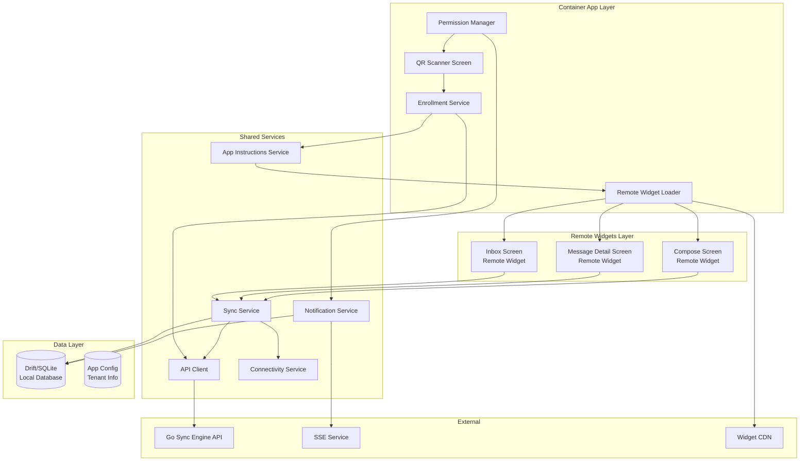

# Flutter Mobile Application Specification

## Overview

The Flutter mobile application is a **container app** that uses **Flutter Remote Widgets** to provide an offline-first messaging client. The container app handles all permissions, QR code scanning for enrollment, and loads tenant-specific remote widgets from the backend. It uses Drift (SQLite) as the primary database and provides seamless messaging functionality with background synchronization when the device is online.

## Architecture

The mobile app uses a two-layer architecture:

1. **Container App Layer**: Handles permissions, enrollment, remote widget loading, and shared services
2. **Remote Widgets Layer**: Tenant-specific UI components fetched from the backend



## Project Structure

```
lib/
├── main.dart                    # App entry point
├── app.dart                     # App widget with providers
│
├── container/                   # Container App Components
│   ├── screens/
│   │   ├── enrollment_screen.dart # QR scanner for enrollment
│   │   └── loading_screen.dart   # Loading remote widgets
│   ├── services/
│   │   ├── enrollment_service.dart # Enrollment logic
│   │   ├── remote_widget_loader.dart # Load remote widgets
│   │   ├── app_instructions_service.dart # Fetch app instructions
│   │   └── permission_service.dart # Permission management
│   └── widgets/
│       └── qr_scanner_widget.dart # QR code scanner
│
├── remote_widgets/             # Remote Widgets (Tenant-Specific)
│   ├── screens/
│   │   ├── inbox_screen.dart   # Message inbox (remote)
│   │   ├── message_detail_screen.dart # Message view (remote)
│   │   └── compose_screen.dart # Compose message (remote)
│   └── widgets/
│       ├── message_list_item.dart # Message list item (remote)
│       ├── message_bubble.dart    # Message bubble (remote)
│       └── offline_indicator.dart # Offline indicator (remote)
│
├── shared/                      # Shared Services & Models
│   ├── models/
│   │   ├── user.dart           # User model
│   │   ├── message.dart        # Message model
│   │   ├── sync_status.dart    # Sync status model
│   │   ├── enrollment.dart     # Enrollment model
│   │   └── app_instructions.dart # App instructions model
│   │
│   ├── database/
│   │   ├── app_database.dart   # Drift database definition
│   │   ├── tables/
│   │   │   ├── users_table.dart # Users table definition
│   │   │   ├── messages_table.dart # Messages table definition
│   │   │   └── app_config_table.dart # App config table
│   │   └── migrations/
│   │       └── migration_1.dart # Database migrations
│   │
│   └── services/
│       ├── sync_service.dart    # Bidirectional sync logic
│       ├── api_client.dart      # HTTP API client
│       ├── notification_service.dart # Push notifications
│       ├── connectivity_service.dart # Network connectivity
│       └── device_service.dart  # Device ID management
│
└── utils/
    ├── constants.dart           # App constants
    └── helpers.dart             # Helper functions
```

## Data Models (Drift)

### User Model

```dart
@DataClassName('User')
class Users extends Table {
  TextColumn get id => text()();
  TextColumn get username => text()();
  TextColumn get userType => text()(); // 'web' or 'mobile'
  BoolColumn get onlineStatus => boolean().withDefault(const Constant(false))();
  DateTimeColumn get lastSeen => dateTime().nullable()();
  DateTimeColumn get createdAt => dateTime()();
  DateTimeColumn get updatedAt => dateTime()();
  
  @override
  Set<Column> get primaryKey => {id};
}
```

### Message Model

```dart
@DataClassName('Message')
class Messages extends Table {
  TextColumn get id => text()();
  TextColumn get senderId => text()();
  TextColumn get recipientId => text()();
  TextColumn get content => text()();
  TextColumn get status => text().withDefault(const Constant('pending_sync'))(); 
  // Status values: 'pending_sync', 'synced', 'read'
  DateTimeColumn get createdAt => dateTime()();
  DateTimeColumn get updatedAt => dateTime()();
  DateTimeColumn get syncedAt => dateTime().nullable()();
  DateTimeColumn get readAt => dateTime().nullable()();
  
  @override
  Set<Column> get primaryKey => {id};
  
  @override
  List<Set<Column>> get uniqueKeys => [
    {id}
  ];
}
```

### Sync Metadata Model

```dart
@DataClassName('SyncMetadata')
class SyncMetadata extends Table {
  TextColumn get deviceId => text()();
  DateTimeColumn get lastSyncTimestamp => dateTime().nullable()();
  IntColumn get pendingOutgoingCount => integer().withDefault(const Constant(0))();
  TextColumn get syncStatus => text().withDefault(const Constant('idle'))(); 
  // Status values: 'idle', 'syncing', 'error'
  DateTimeColumn get createdAt => dateTime()();
  DateTimeColumn get updatedAt => dateTime()();
  
  @override
  Set<Column> get primaryKey => {deviceId};
}
```

### App Config Model

```dart
@DataClassName('AppConfig')
class AppConfig extends Table {
  TextColumn get key => text()();
  TextColumn get value => text()();
  DateTimeColumn get updatedAt => dateTime()();
  
  @override
  Set<Column> get primaryKey => {key};
}
```

Stores tenant configuration and app instructions:
- `tenant_id`: Tenant identifier
- `api_base_url`: Backend API base URL
- `app_instructions`: JSON string of app instructions
- `enrolled_at`: Enrollment timestamp
- `device_id`: Device identifier

### App Database

```dart
@DriftDatabase(tables: [Users, Messages, SyncMetadata, AppConfig])
class AppDatabase extends _$AppDatabase {
  AppDatabase() : super(_openConnection());
  
  @override
  int get schemaVersion => 1;
  
  @override
  MigrationStrategy get migration {
    return MigrationStrategy(
      onCreate: (Migrator m) async {
        await m.createAll();
      },
      onUpgrade: (Migrator m, int from, int to) async {
        // Handle migrations
      },
    );
  }
}
```

## Container App Components

### Enrollment Screen

**Purpose**: First screen shown when app is not enrolled. Displays QR code scanner.

**Features:**
- QR code scanner using camera
- Instructions for scanning enrollment QR code
- Permission request for camera
- Error handling for invalid QR codes
- Loading state during enrollment

**Implementation:**
```dart
class EnrollmentScreen extends ConsumerStatefulWidget {
  // QR scanner widget
  // Enrollment instructions
  // Permission handling
}
```

### Enrollment Service

**Responsibilities:**
- Scan and parse QR code data
- Validate enrollment token with backend
- Complete enrollment with device information
- Fetch app instructions after enrollment
- Store enrollment data locally

**Key Methods:**

```dart
class EnrollmentService {
  // Scan QR code and extract enrollment data
  Future<EnrollmentData> scanQRCode();
  
  // Validate enrollment token
  Future<EnrollmentDetails> validateToken(String token);
  
  // Complete enrollment
  Future<EnrollmentResult> completeEnrollment({
    required String token,
    required String deviceId,
    required Map<String, dynamic> deviceInfo,
  });
  
  // Check if app is enrolled
  Future<bool> isEnrolled();
  
  // Get current tenant ID
  Future<String?> getTenantId();
}
```

**Enrollment Flow:**
1. User opens app (not enrolled)
2. App shows QR scanner screen
3. User scans QR code from web interface
4. Extract token from QR code data
5. Call `GET /api/enrollment/:token` to validate
6. Call `POST /api/enrollment/complete` with device info
7. Backend creates user and returns app instructions URL
8. Call `GET /api/app-instructions` to fetch widget config
9. Store tenant ID and app instructions locally
10. Load remote widgets based on instructions
11. App ready for use

### Remote Widget Loader

**Responsibilities:**
- Fetch remote widget definitions from CDN/backend
- Cache widgets locally for offline use
- Render remote widgets using Flutter Remote Widgets
- Handle widget version updates
- Manage widget lifecycle

**Key Methods:**

```dart
class RemoteWidgetLoader {
  // Load app instructions from backend
  Future<AppInstructions> loadAppInstructions();
  
  // Fetch remote widget from URL
  Future<Widget> loadRemoteWidget(String widgetUrl);
  
  // Cache widget locally
  Future<void> cacheWidget(String widgetId, Widget widget);
  
  // Get cached widget
  Future<Widget?> getCachedWidget(String widgetId);
  
  // Check for widget updates
  Future<bool> checkForUpdates();
}
```

**Widget Loading Flow:**
1. App instructions contain widget URLs
2. Loader fetches widget JSON from CDN
3. Parse widget definition
4. Render using Flutter Remote Widgets
5. Cache widget for offline use
6. Check for updates periodically

### App Instructions Service

**Responsibilities:**
- Fetch app instructions from backend
- Parse app instructions JSON
- Store instructions locally
- Provide configuration to other services

**App Instructions Structure:**

```dart
class AppInstructions {
  final String version;
  final String tenantId;
  final String apiBaseUrl;
  final Map<String, WidgetConfig> widgets;
  final SyncConfig syncConfig;
}

class WidgetConfig {
  final String type; // 'remote_widget'
  final String url;  // Widget JSON URL
}

class SyncConfig {
  final int batchSize;
  final bool compression;
}
```

### Permission Manager

**Responsibilities:**
- Request all necessary permissions
- Check permission status
- Handle permission denials
- Guide users to settings if needed

**Required Permissions:**
- **Camera**: For QR code scanning
- **Internet**: For API communication
- **Network State**: For connectivity monitoring
- **Storage**: For SQLite database
- **Notifications**: For push notifications
- **Background Sync**: For background synchronization

**Implementation:**
```dart
class PermissionService {
  // Request all permissions
  Future<Map<Permission, PermissionStatus>> requestAllPermissions();
  
  // Check specific permission
  Future<PermissionStatus> checkPermission(Permission permission);
  
  // Open app settings
  Future<void> openAppSettings();
}
```

## Services

### Sync Service

**Responsibilities:**
- Bidirectional synchronization (incoming + outgoing)
- Background sync when device comes online
- Status tracking (pending_sync → synced)
- Conflict detection and resolution
- Retry logic with exponential backoff
- Compression support

**Key Methods:**

```dart
class SyncService {
  // Perform full bidirectional sync
  Future<SyncResult> performSync();
  
  // Sync incoming messages from backend
  Future<List<Message>> syncIncoming();
  
  // Sync outgoing messages to backend
  Future<int> syncOutgoing();
  
  // Get sync status
  Future<SyncStatus> getSyncStatus();
  
  // Trigger manual sync
  Future<void> triggerSync();
}
```

**Sync Flow:**
1. Check network connectivity
2. Get device ID
3. Fetch pending incoming messages from backend (`GET /api/sync/incoming`)
4. Save incoming messages to local database
5. Get pending outgoing messages from local database (status = 'pending_sync')
6. Upload outgoing messages to backend (`POST /api/sync/outgoing`)
7. Update local message status to 'synced'
8. Update sync metadata
9. Trigger notifications for new messages

**Offline Handling:**
- All operations work against local SQLite
- Messages saved with 'pending_sync' status when offline
- Sync service queues sync operations
- Automatic retry when connectivity restored

### API Client

**Responsibilities:**
- HTTP communication with backend
- Request/response serialization
- Error handling
- Compression/decompression
- Device ID header management

**Key Methods:**

```dart
class APIClient {
  // Get pending incoming messages
  Future<List<Message>> getIncomingMessages({
    DateTime? since,
    int limit = 100,
  });
  
  // Upload outgoing messages
  Future<SyncResponse> uploadOutgoingMessages(List<Message> messages);
  
  // Get sync status
  Future<SyncStatus> getSyncStatus();
}
```

**Key Methods (Updated):**

```dart
class APIClient {
  // Enrollment endpoints
  Future<EnrollmentDetails> getEnrollmentDetails(String token);
  Future<EnrollmentResult> completeEnrollment(EnrollmentRequest request);
  Future<AppInstructions> getAppInstructions();
  
  // Sync endpoints
  Future<List<Message>> getIncomingMessages({
    DateTime? since,
    int limit = 100,
  });
  Future<SyncResponse> uploadOutgoingMessages(List<Message> messages);
  Future<SyncStatus> getSyncStatus();
}
```

**Configuration:**
- Base URL: Fetched from app instructions (tenant-specific)
- Timeout: 30 seconds
- Headers: X-Device-ID, Content-Type, Content-Encoding (for compression)
- API base URL stored in app config after enrollment

### Notification Service

**Responsibilities:**
- Listen to SSE stream for new messages
- Show local notifications
- Handle notification taps
- Manage notification channels

**SSE Connection:**
- Connect to `/sse/mobile/:device_id`
- Listen for 'message' and 'sync_required' events
- Reconnect on connection loss
- Background connection management

### Connectivity Service

**Responsibilities:**
- Monitor network connectivity
- Detect online/offline state
- Trigger sync when connectivity restored
- Provide connectivity status to UI

**Implementation:**
- Uses `connectivity_plus` package
- Streams connectivity changes
- Distinguishes between WiFi and mobile data

## Remote Widgets (Tenant-Specific UI)

The messaging UI is implemented as remote widgets that are fetched from the backend after enrollment. These widgets are tenant-specific and can be updated without app store releases.

### Inbox Screen (Remote Widget)

**Features:**
- List of received messages (sorted by created_at DESC)
- Unread indicators (badge count)
- Offline/online status indicator
- Pull-to-refresh for manual sync
- Empty state when no messages
- Loading state during sync

**State Management:**
- Uses Riverpod for state management
- Watches messages stream from database
- Updates on sync completion

**Key Widgets:**
```dart
class InboxScreen extends ConsumerWidget {
  // Displays list of messages
  // Shows sync status
  // Handles pull-to-refresh
}
```

### Message Detail Screen (Remote Widget)

**Features:**
- Full message content display
- Sender information (username)
- Timestamp (formatted)
- Reply functionality
- Status indicator (synced/pending)
- Mark as read functionality

**State Management:**
- Loads message from database
- Updates read status on view
- Handles reply composition

**Remote Widget Implementation:**
- Widget definition fetched from CDN
- Rendered using Flutter Remote Widgets
- Can be updated without app update

### Compose Screen (Remote Widget)

**Features:**
- Recipient selection (if replying, pre-filled)
- Message input (multi-line text field)
- Send button (works offline)
- Status feedback (pending/sent)
- Character count (optional)
- Validation (non-empty message)

**State Management:**
- Manages message composition state
- Saves message to database immediately
- Triggers sync if online

**Remote Widget Implementation:**
- Widget definition fetched from CDN
- Rendered using Flutter Remote Widgets
- Tenant-specific UI customization

## Widgets

### Message List Item

**Features:**
- Sender name
- Message preview (truncated)
- Timestamp
- Unread indicator
- Status indicator (synced/pending)

### Offline Indicator

**Features:**
- Shows offline/online status
- Sync status (idle/syncing/error)
- Pending message count
- Manual sync button

### Sync Status Indicator

**Features:**
- Visual sync status
- Last sync time
- Pending count
- Error messages

## Offline-First Logic

### Message Creation
1. User composes message
2. Message saved to local SQLite with status 'pending_sync'
3. UI shows message immediately (optimistic update)
4. If online, trigger sync immediately
5. If offline, message queued for next sync

### Message Reading
1. User opens message
2. Message loaded from local database
3. If not read, update read_at timestamp locally
4. Mark as read in database
5. Sync read status on next sync

### Sync Strategy
- **On App Start:** Check connectivity, sync if online
- **On Connectivity Restored:** Automatic sync
- **Periodic Sync:** Every 5 minutes when online (configurable)
- **Manual Sync:** Pull-to-refresh or sync button
- **After Message Send:** Immediate sync if online

### Conflict Resolution
- **Last-Write-Wins:** Backend timestamp wins
- **Local Priority:** For read status, local takes precedence
- **Merge Strategy:** For content conflicts, backend version used

## Error Handling

### Network Errors
- Retry with exponential backoff
- Show user-friendly error messages
- Queue operations for retry
- Maintain offline functionality

### Sync Errors
- Log error details
- Update sync status to 'error'
- Show error indicator in UI
- Allow manual retry

### Database Errors
- Handle corruption detection
- Attempt recovery
- Show error to user
- Suggest reinstall if severe

## State Management

### Riverpod Providers

```dart
// Database provider
final appDatabaseProvider = Provider<AppDatabase>((ref) => AppDatabase());

// Sync service provider
final syncServiceProvider = Provider<SyncService>((ref) {
  return SyncService(ref.read(appDatabaseProvider));
});

// Messages stream provider
final messagesProvider = StreamProvider<List<Message>>((ref) {
  final db = ref.read(appDatabaseProvider);
  return db.messagesDao.watchAllMessages();
});

// Connectivity provider
final connectivityProvider = StreamProvider<ConnectivityResult>((ref) {
  return ConnectivityService().onConnectivityChanged;
});
```

## Dependencies

```yaml
dependencies:
  flutter:
    sdk: flutter
  drift: ^2.14.0
  sqlite3_flutter_libs: ^0.5.18
  path_provider: ^2.1.1
  path: ^1.8.3
  riverpod: ^2.4.9
  flutter_riverpod: ^2.4.9
  http: ^1.1.2
  connectivity_plus: ^5.0.2
  flutter_local_notifications: ^16.3.0
  shared_preferences: ^2.2.2
  device_info_plus: ^9.1.1
  uuid: ^4.2.1
  # Container app & enrollment
  qr_code_scanner: ^1.0.1  # or mobile_scanner: ^3.5.0
  permission_handler: ^11.0.1
  # Remote widgets
  flutter_remote_widgets: ^1.0.0  # Flutter Remote Widgets package
  # QR code parsing
  qr_code_tools: ^1.0.0  # For parsing QR code data
```

## Enrollment Flow

### Initial App Launch (Not Enrolled)

1. App checks if enrolled (checks app config)
2. If not enrolled, show QR scanner screen
3. Request camera permission
4. Display QR scanner with instructions
5. Wait for user to scan enrollment QR code

### QR Code Scanning

1. User scans QR code from web interface
2. QR code contains enrollment URL: `https://backend.example.com/api/enrollment/{token}`
3. Extract token from URL
4. Validate token format (UUID)
5. Call enrollment service to validate

### Enrollment Process

1. **Validate Token**: `GET /api/enrollment/:token`
   - Check if token exists and is valid
   - Check if token is expired
   - Return tenant ID and enrollment details

2. **Complete Enrollment**: `POST /api/enrollment/complete`
   - Send device ID and device information
   - Backend creates mobile user account
   - Backend links device to tenant
   - Return user ID and app instructions URL

3. **Fetch App Instructions**: `GET /api/app-instructions`
   - Get widget URLs and configuration
   - Store tenant ID and API base URL
   - Store app instructions locally

4. **Load Remote Widgets**: 
   - Fetch widget definitions from CDN
   - Cache widgets locally
   - Render widgets using Flutter Remote Widgets

5. **App Ready**: 
   - Show messaging interface
   - Start sync service
   - Connect to SSE stream

### Re-enrollment

If user needs to switch tenants or re-enroll:
1. Clear app config
2. Show QR scanner again
3. Follow enrollment flow

## App Instructions Format

The app instructions JSON fetched from the backend contains:

```json
{
  "version": "1.0.0",
  "tenant_id": "tenant_1",
  "api_base_url": "https://backend.example.com",
  "widgets": {
    "inbox": {
      "type": "remote_widget",
      "url": "https://cdn.example.com/widgets/inbox.json",
      "version": "1.0.0"
    },
    "compose": {
      "type": "remote_widget",
      "url": "https://cdn.example.com/widgets/compose.json",
      "version": "1.0.0"
    },
    "message_detail": {
      "type": "remote_widget",
      "url": "https://cdn.example.com/widgets/message_detail.json",
      "version": "1.0.0"
    }
  },
  "sync_config": {
    "batch_size": 100,
    "compression": true,
    "sync_interval_seconds": 300
  }
}
```

## State Management

### Riverpod Providers

```dart
// Enrollment state
final enrollmentStateProvider = StateNotifierProvider<EnrollmentNotifier, EnrollmentState>((ref) {
  return EnrollmentNotifier(ref.read(enrollmentServiceProvider));
});

// App config provider
final appConfigProvider = FutureProvider<AppConfig>((ref) async {
  final db = ref.read(appDatabaseProvider);
  return await db.appConfigDao.getConfig();
});

// Remote widget loader provider
final remoteWidgetLoaderProvider = Provider<RemoteWidgetLoader>((ref) {
  return RemoteWidgetLoader(ref.read(appInstructionsServiceProvider));
});

// Database provider
final appDatabaseProvider = Provider<AppDatabase>((ref) => AppDatabase());

// Sync service provider
final syncServiceProvider = Provider<SyncService>((ref) {
  return SyncService(ref.read(appDatabaseProvider));
});

// Messages stream provider
final messagesProvider = StreamProvider<List<Message>>((ref) {
  final db = ref.read(appDatabaseProvider);
  return db.messagesDao.watchAllMessages();
});

// Connectivity provider
final connectivityProvider = StreamProvider<ConnectivityResult>((ref) {
  return ConnectivityService().onConnectivityChanged;
});
```

## Testing

### Unit Tests
- Database operations
- Sync service logic
- API client
- Model serialization

### Widget Tests
- Screen rendering
- User interactions
- State updates

### Integration Tests
- End-to-end sync flow
- Offline message creation
- Online sync
- Notification handling

## Performance Considerations

### Database
- Indexed queries for fast lookups
- Batch operations for sync
- Efficient pagination

### UI
- List virtualization for large message lists
- Image caching
- Lazy loading

### Sync
- Batch size optimization
- Compression for large payloads
- Background sync to avoid UI blocking

