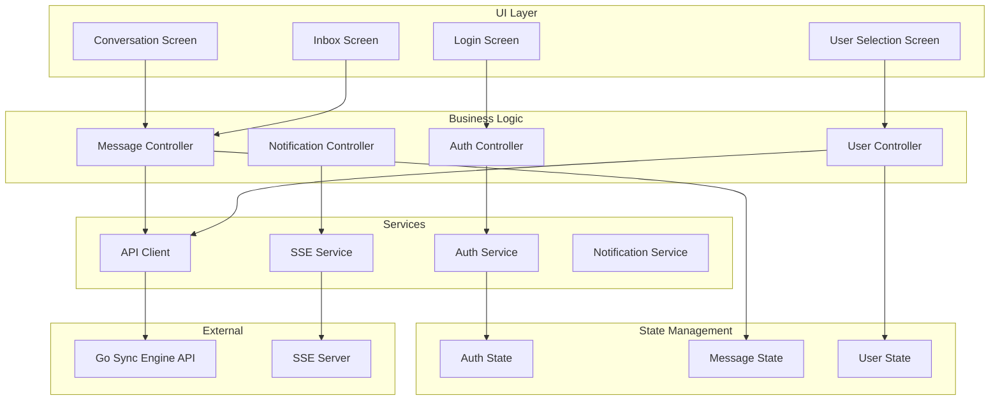

# Flutter Web Application Specification

## Overview

The Flutter web application enables web users to send messages to mobile users, receive replies, and manage conversations with real-time updates via Server-Sent Events (SSE). It provides a responsive web interface with authentication, user selection, and messaging capabilities.

## Architecture



## Project Structure

```
lib/
├── main.dart                    # App entry point
├── app.dart                     # App widget with providers
│
├── models/
│   ├── user.dart               # User model
│   ├── message.dart            # Message model
│   ├── notification.dart       # Notification model
│   └── auth.dart               # Auth model
│
├── services/
│   ├── auth_service.dart       # Authentication service
│   ├── api_client.dart         # HTTP API client
│   ├── sse_service.dart        # SSE connection service
│   ├── notification_service.dart # Notification handling
│   └── enrollment_service.dart # Enrollment service
│
├── screens/
│   ├── login_screen.dart       # Login screen
│   ├── user_selection_screen.dart # User selection
│   ├── enrollment_screen.dart  # Mobile user enrollment
│   ├── conversation_screen.dart # Conversation view
│   └── inbox_screen.dart       # Inbox view
│
├── widgets/
│   ├── user_list_item.dart     # User list item
│   ├── message_bubble.dart     # Message bubble
│   ├── inbox_icon.dart         # Inbox icon with badge
│   ├── user_status_indicator.dart # Online/offline indicator
│   ├── message_status_indicator.dart # Message status
│   ├── qr_code_widget.dart     # QR code display widget
│   └── enrollment_status_widget.dart # Enrollment status widget
│
└── utils/
    ├── constants.dart          # App constants
    ├── storage.dart            # Local storage helpers
    └── helpers.dart            # Helper functions
```

## Data Models

### User Model

```dart
class User {
  final String id;
  final String username;
  final String userType; // 'web' or 'mobile'
  final String? deviceId;
  final bool onlineStatus;
  final DateTime? lastSeen;
  final DateTime createdAt;
  final DateTime updatedAt;

  User({
    required this.id,
    required this.username,
    required this.userType,
    this.deviceId,
    required this.onlineStatus,
    this.lastSeen,
    required this.createdAt,
    required this.updatedAt,
  });

  factory User.fromJson(Map<String, dynamic> json) {
    return User(
      id: json['id'],
      username: json['username'],
      userType: json['user_type'],
      deviceId: json['device_id'],
      onlineStatus: json['online_status'] ?? false,
      lastSeen: json['last_seen'] != null 
          ? DateTime.parse(json['last_seen']) 
          : null,
      createdAt: DateTime.parse(json['created_at']),
      updatedAt: DateTime.parse(json['updated_at']),
    );
  }
}
```

### Message Model

```dart
class Message {
  final String id;
  final String senderId;
  final String recipientId;
  final String content;
  final String status; // 'pending_sync', 'synced', 'read'
  final DateTime createdAt;
  final DateTime updatedAt;
  final DateTime? syncedAt;
  final DateTime? readAt;

  Message({
    required this.id,
    required this.senderId,
    required this.recipientId,
    required this.content,
    required this.status,
    required this.createdAt,
    required this.updatedAt,
    this.syncedAt,
    this.readAt,
  });

  factory Message.fromJson(Map<String, dynamic> json) {
    return Message(
      id: json['id'],
      senderId: json['sender_id'],
      recipientId: json['recipient_id'],
      content: json['content'],
      status: json['status'],
      createdAt: DateTime.parse(json['created_at']),
      updatedAt: DateTime.parse(json['updated_at']),
      syncedAt: json['synced_at'] != null 
          ? DateTime.parse(json['synced_at']) 
          : null,
      readAt: json['read_at'] != null 
          ? DateTime.parse(json['read_at']) 
          : null,
    );
  }
}
```

### Notification Model

```dart
class Notification {
  final String type; // 'new_message', 'message_read'
  final String? messageId;
  final int? unreadCount;

  Notification({
    required this.type,
    this.messageId,
    this.unreadCount,
  });

  factory Notification.fromJson(Map<String, dynamic> json) {
    return Notification(
      type: json['type'],
      messageId: json['message_id'],
      unreadCount: json['unread_count'],
    );
  }
}
```

## Services

### Auth Service

**Responsibilities:**
- User authentication
- JWT token management
- Session persistence
- Logout functionality

**Key Methods:**

```dart
class AuthService {
  // Login with credentials
  Future<AuthResult> login(String username, String password);
  
  // Get current user
  User? getCurrentUser();
  
  // Check if authenticated
  bool isAuthenticated();
  
  // Logout
  Future<void> logout();
  
  // Get auth token
  String? getToken();
}
```

**Token Storage:**
- Store JWT token in browser localStorage
- Include token in API requests (Authorization header)
- Handle token expiration
- Refresh token if supported

### API Client

**Responsibilities:**
- HTTP communication with backend
- Request/response serialization
- Error handling
- Token management

**Key Methods:**

```dart
class APIClient {
  // Authentication
  Future<AuthResponse> login(String username, String password);
  
  // Users
  Future<List<User>> getUsers({String? filter, bool? status});
  Future<User> getUser(String id);
  
  // Enrollment
  Future<EnrollmentResponse> createEnrollment();
  Future<EnrollmentStatus> getEnrollmentStatus(String token);
  
  // Messages
  Future<Message> sendMessage(String recipientId, String content);
  Future<List<Message>> getMessages({
    String? recipientId,
    String? status,
    int? limit,
    int? offset,
  });
  Future<int> getUnreadCount();
  Future<Message> getMessage(String id);
  Future<Message> markMessageAsRead(String id);
}
```

**Configuration:**
- Base URL: Configurable (default: http://localhost:8080)
- Timeout: 30 seconds
- Headers: Authorization (Bearer token), Content-Type

### SSE Service

**Responsibilities:**
- Connect to SSE endpoint
- Listen for real-time events
- Handle reconnection
- Parse event data

**Key Methods:**

```dart
class SSEService {
  // Connect to SSE stream
  Stream<Notification> connect(String userId);
  
  // Disconnect
  void disconnect();
  
  // Check connection status
  bool isConnected();
}
```

**SSE Connection:**
- Endpoint: `/sse/web/:user_id`
- Headers: Authorization (Bearer token)
- Event types: 'new_message', 'message_read'
- Auto-reconnect on connection loss
- Exponential backoff for reconnection

**Event Handling:**
```dart
// Listen for events
sseService.connect(userId).listen((notification) {
  if (notification.type == 'new_message') {
    // Update inbox count
    // Show notification
    // Refresh message list
  } else if (notification.type == 'message_read') {
    // Update message status
  }
});
```

### Enrollment Service

**Responsibilities:**
- Create enrollment tokens
- Generate QR code data
- Track enrollment status
- Poll for enrollment completion

**Key Methods:**

```dart
class EnrollmentService {
  // Create enrollment token
  Future<EnrollmentResponse> createEnrollment();
  
  // Get enrollment status
  Future<EnrollmentStatus> getEnrollmentStatus(String token);
  
  // Generate QR code data
  Map<String, dynamic> generateQRCodeData(EnrollmentResponse enrollment);
  
  // Check if enrollment is completed
  Future<bool> isEnrollmentCompleted(String token);
  
  // Cancel enrollment
  Future<void> cancelEnrollment(String token);
}
```

**Enrollment Response Model:**

```dart
class EnrollmentResponse {
  final String token;
  final Map<String, dynamic> qrCodeData;
  final DateTime expiresAt;
  final String enrollmentUrl;
  
  EnrollmentResponse({
    required this.token,
    required this.qrCodeData,
    required this.expiresAt,
    required this.enrollmentUrl,
  });
  
  factory EnrollmentResponse.fromJson(Map<String, dynamic> json) {
    return EnrollmentResponse(
      token: json['token'],
      qrCodeData: json['qr_code_data'],
      expiresAt: DateTime.parse(json['expires_at']),
      enrollmentUrl: json['qr_code_data']['enrollment_url'],
    );
  }
}
```

**QR Code Data Format:**

```json
{
  "enrollment_url": "https://backend.example.com/api/enrollment/550e8400-e29b-41d4-a716-446655440000",
  "token": "550e8400-e29b-41d4-a716-446655440000",
  "tenant_id": "tenant_1"
}
```

### Notification Service

**Responsibilities:**
- Show browser notifications
- Update inbox badge count
- Handle notification clicks
- Manage notification state

**Key Methods:**

```dart
class NotificationService {
  // Show notification
  Future<void> showNotification(String title, String body);
  
  // Update inbox badge
  void updateBadge(int count);
  
  // Clear notifications
  void clearNotifications();
}
```

## UI Components

### Login Screen

**Features:**
- Username input field
- Password input field
- Login button
- Error message display
- Loading state during authentication

**State Management:**
- Form validation
- Authentication state
- Error handling

**Key Widgets:**
```dart
class LoginScreen extends ConsumerStatefulWidget {
  // Login form
  // Authentication handling
  // Navigation to user selection on success
}
```

### User Selection Screen

**Features:**
- List of available mobile users
- Online/offline status indicators
- Search/filter functionality
- User selection to start conversation
- **"Enroll Mobile User" button** - Opens enrollment screen
- Empty state when no users

**State Management:**
- User list state
- Filter state
- Loading state

**Key Widgets:**
```dart
class UserSelectionScreen extends ConsumerWidget {
  // User list
  // Search/filter
  // Status indicators
  // "Enroll Mobile User" button
  // Navigation to conversation
}
```

### Enrollment Screen

**Features:**
- QR code display (generated from enrollment token)
- Enrollment instructions for mobile user
- Enrollment status tracking (pending, completed, expired)
- Token expiration countdown
- Refresh QR code option
- Cancel enrollment option
- Success message when enrollment completed
- Auto-refresh when enrollment is detected

**State Management:**
- Enrollment token state
- QR code data state
- Enrollment status polling
- Expiration timer

**Key Widgets:**
```dart
class EnrollmentScreen extends ConsumerStatefulWidget {
  // QR code display
  // Enrollment instructions
  // Status indicator
  // Expiration timer
  // Cancel button
}
```

**Enrollment Flow:**
1. User clicks "Enroll Mobile User" from user selection screen
2. Screen calls `EnrollmentService.createEnrollment()`
3. Backend creates enrollment token
4. Screen generates QR code from enrollment data
5. QR code displayed with instructions
6. Screen polls for enrollment completion
7. When mobile user completes enrollment, screen shows success
8. User can navigate back to user selection

**QR Code Widget:**

```dart
class QRCodeWidget extends StatelessWidget {
  final String data; // Enrollment URL or JSON data
  
  // Displays QR code using qr_flutter package
  // Shows enrollment URL below QR code
  // Copy to clipboard option
}
```

**Enrollment Status Widget:**

```dart
class EnrollmentStatusWidget extends ConsumerWidget {
  final String token;
  
  // Shows enrollment status
  // Pending: "Waiting for mobile user to scan..."
  // Completed: "Enrollment successful!"
  // Expired: "Enrollment expired. Please generate a new QR code."
  // Polls status every 2 seconds
}
```

### Conversation Screen

**Features:**
- Message history display
- Message composition area
- Send button
- Real-time message updates via SSE
- Message status indicators (sent, delivered, read)
- Scroll to bottom on new message
- Loading state

**State Management:**
- Message list state
- Composed message state
- Real-time updates from SSE
- Polling fallback if SSE unavailable

**Key Widgets:**
```dart
class ConversationScreen extends ConsumerStatefulWidget {
  // Message list
  // Compose area
  // Real-time updates
  // Status indicators
}
```

### Inbox Screen

**Features:**
- List of conversations (grouped by recipient)
- Unread message indicators
- Last message preview
- Timestamp
- Click to open conversation
- Mark as read functionality

**State Management:**
- Conversation list state
- Unread count state
- Real-time updates

**Key Widgets:**
```dart
class InboxScreen extends ConsumerWidget {
  // Conversation list
  // Unread indicators
  // Navigation to conversation
}
```

## Widgets

### User List Item

**Features:**
- Username display
- Online/offline status indicator
- Last seen timestamp
- Click to select user

### Message Bubble

**Features:**
- Message content
- Timestamp
- Status indicator (sent, delivered, read)
- Sender/recipient styling
- Word wrap and formatting

### Inbox Icon

**Features:**
- Inbox icon
- Unread count badge
- Click to open inbox
- Badge updates in real-time

### User Status Indicator

**Features:**
- Online (green dot)
- Offline (gray dot)
- Last seen text

### Message Status Indicator

**Features:**
- Pending (clock icon)
- Sent (check icon)
- Delivered (double check)
- Read (double check with color)

### QR Code Widget

**Features:**
- Displays QR code from enrollment data
- Shows enrollment URL below QR code
- Copy URL to clipboard button
- Refresh QR code option
- Size customization

**Implementation:**
- Uses `qr_flutter` package for QR code generation
- Encodes enrollment URL or JSON data
- Error correction level: Medium

### Enrollment Status Widget

**Features:**
- Real-time enrollment status display
- Status indicators (pending, completed, expired)
- Expiration countdown timer
- Auto-refresh polling
- Success/error messages

## Real-Time Updates

### SSE Integration

**Connection Setup:**
1. After successful login, connect to SSE endpoint
2. Pass user ID and auth token
3. Listen for events
4. Update UI based on event type

**Event Types:**
- `new_message`: New message received
  - Update inbox count
  - Show notification
  - Refresh message list if in conversation
- `message_read`: Message was read
  - Update message status in UI

**Reconnection Logic:**
- Detect connection loss
- Exponential backoff (1s, 2s, 4s, 8s, max 30s)
- Reconnect automatically
- Show connection status indicator

### Polling Fallback

**When SSE Unavailable:**
- Fall back to polling every 5 seconds
- Poll `/api/messages/unread-count` for badge updates
- Poll `/api/messages` for new messages in active conversation
- Show polling indicator

**Implementation:**
```dart
// Polling service
class PollingService {
  Timer? _timer;
  
  void startPolling() {
    _timer = Timer.periodic(Duration(seconds: 5), (timer) {
      _pollForUpdates();
    });
  }
  
  void stopPolling() {
    _timer?.cancel();
  }
}
```

## State Management

### Riverpod Providers

```dart
// Auth provider
final authServiceProvider = Provider<AuthService>((ref) => AuthService());
final authStateProvider = StateNotifierProvider<AuthNotifier, AuthState>((ref) {
  return AuthNotifier(ref.read(authServiceProvider));
});

// API client provider
final apiClientProvider = Provider<APIClient>((ref) {
  final authService = ref.read(authServiceProvider);
  return APIClient(authService);
});

// SSE service provider
final sseServiceProvider = Provider<SSEService>((ref) => SSEService());

// Enrollment service provider
final enrollmentServiceProvider = Provider<EnrollmentService>((ref) {
  return EnrollmentService(ref.read(apiClientProvider));
});

// Enrollment state provider
final enrollmentStateProvider = StateNotifierProvider<EnrollmentNotifier, EnrollmentState>((ref) {
  return EnrollmentNotifier(ref.read(enrollmentServiceProvider));
});

// Users provider
final usersProvider = FutureProvider<List<User>>((ref) async {
  final apiClient = ref.read(apiClientProvider);
  return await apiClient.getUsers();
});

// Messages provider
final messagesProvider = StateNotifierProvider<MessagesNotifier, MessagesState>((ref) {
  return MessagesNotifier(ref.read(apiClientProvider));
});

// Unread count provider
final unreadCountProvider = StateProvider<int>((ref) => 0);
```

## Routing

### Route Configuration

```dart
final routerProvider = Provider<GoRouter>((ref) {
  final authState = ref.watch(authStateProvider);
  
  return GoRouter(
    initialLocation: '/login',
    routes: [
      GoRoute(
        path: '/login',
        builder: (context, state) => LoginScreen(),
      ),
      GoRoute(
        path: '/users',
        builder: (context, state) => UserSelectionScreen(),
        redirect: (context, state) {
          if (authState.isAuthenticated) return null;
          return '/login';
        },
      ),
      GoRoute(
        path: '/enroll',
        builder: (context, state) => EnrollmentScreen(),
        redirect: (context, state) {
          if (authState.isAuthenticated) return null;
          return '/login';
        },
      ),
      GoRoute(
        path: '/conversation/:recipientId',
        builder: (context, state) => ConversationScreen(
          recipientId: state.params['recipientId']!,
        ),
      ),
      GoRoute(
        path: '/inbox',
        builder: (context, state) => InboxScreen(),
      ),
    ],
  );
});
```

## Error Handling

### Authentication Errors
- Invalid credentials: Show error message
- Token expired: Redirect to login
- Network error: Show retry option

### API Errors
- Network errors: Show connection error, allow retry
- Validation errors: Show field-specific errors
- Server errors: Show generic error message
- 401 Unauthorized: Redirect to login

### SSE Errors
- Connection failed: Fall back to polling
- Reconnection failed: Show connection status
- Parse errors: Log and continue

## Responsive Design

### Breakpoints
- Mobile: < 600px
- Tablet: 600px - 1024px
- Desktop: > 1024px

### Layout Adaptations
- Mobile: Single column, bottom navigation
- Tablet: Sidebar + content
- Desktop: Full layout with sidebar

## Dependencies

```yaml
dependencies:
  flutter:
    sdk: flutter
  riverpod: ^2.4.9
  flutter_riverpod: ^2.4.9
  go_router: ^12.1.1
  http: ^1.1.2
  shared_preferences: ^2.2.2
  uuid: ^4.2.1
  intl: ^0.18.1
  qr_flutter: ^4.1.0  # QR code generation
```

## Testing

### Unit Tests
- Service layer tests
- Model serialization
- State management

### Widget Tests
- Screen rendering
- User interactions
- Form validation

### Integration Tests
- Authentication flow
- Enrollment flow (QR code generation and status tracking)
- Message sending
- Real-time updates
- SSE connection

## Performance Considerations

### Optimization
- Lazy loading for message lists
- Virtual scrolling for large lists
- Debounced search input
- Cached user list
- Efficient state updates

### Caching
- Cache user list (with TTL)
- Cache message history
- Cache unread count

### Network
- Request batching where possible
- Compression support
- Connection pooling
- Request cancellation on navigation

