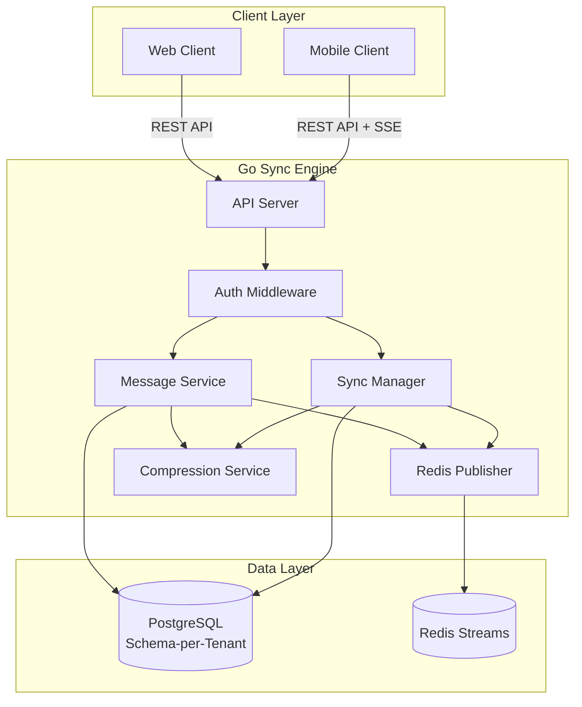

# Go Synchronization Engine Specification

## Overview

The Posduif Go Synchronization Engine is the core backend service that handles bidirectional synchronization between PostgreSQL backend and mobile SQLite databases. It manages web user sessions, distributes events via Redis Streams, and provides real-time updates via Server-Sent Events (SSE).

## Architecture



## Project Structure

```
cmd/
└── sync-engine/
    └── main.go                 # Application entry point

internal/
├── api/
│   ├── handlers/
│   │   ├── auth.go            # Authentication handlers
│   │   ├── messages.go        # Message CRUD handlers
│   │   ├── users.go           # User management handlers
│   │   ├── sync.go            # Sync operation handlers
│   │   └── enrollment.go      # Enrollment handlers
│   ├── middleware/
│   │   ├── auth.go            # JWT authentication
│   │   ├── cors.go            # CORS handling
│   │   └── logging.go         # Request logging
│   └── sse/
│       ├── mobile.go          # Mobile SSE handler
│       └── web.go             # Web SSE handler
├── database/
│   ├── postgres.go            # PostgreSQL connection pool
│   ├── migrations.go          # Schema migrations
│   └── queries.go             # Database queries
├── models/
│   ├── user.go                # User model
│   ├── message.go             # Message model
│   ├── sync_metadata.go       # Sync metadata model
│   └── enrollment.go          # Enrollment model
├── enrollment/
│   ├── service.go             # Enrollment business logic
│   ├── token.go               # Token generation and validation
│   └── qrcode.go              # QR code data generation
├── sync/
│   ├── manager.go             # Sync orchestration
│   ├── incoming.go            # Incoming sync logic
│   ├── outgoing.go            # Outgoing sync logic
│   └── conflict.go           # Conflict resolution
├── message/
│   ├── service.go             # Message business logic
│   ├── validator.go           # Message validation
│   └── notifier.go            # Notification triggers
├── redis/
│   ├── client.go              # Redis connection
│   ├── publisher.go           # Event publishing
│   └── streams.go             # Stream management
└── compression/
    ├── gzip.go                # Gzip compression
    └── metrics.go             # Compression metrics

config/
└── config.yaml                # Configuration file
```

## Core Components

### 1. API Server (`cmd/sync-engine/main.go`)

**Responsibilities:**
- Initialize HTTP server with routing
- Load configuration from YAML
- Set up middleware chain
- Register route handlers
- Start SSE endpoints
- Graceful shutdown handling

**Key Features:**
- HTTP/HTTPS support
- Request timeout configuration
- Graceful shutdown with context cancellation
- Health check endpoint
- Metrics endpoint

### 2. Database Layer (`internal/database/`)

**PostgreSQL Connection (`postgres.go`):**
- Connection pool management
- Schema-per-tenant isolation
- Transaction support
- Connection health checks
- Query timeout handling

**Migrations (`migrations.go`):**
- Schema versioning
- Automatic migration on startup
- Rollback support
- Tenant schema creation

**Queries (`queries.go`):**
- Prepared statements
- Query builders for complex queries
- Batch operations
- WAL-based change detection helpers

### 3. Sync Manager (`internal/sync/`)

**Manager (`manager.go`):**
- Orchestrates bidirectional sync
- Coordinates incoming and outgoing sync
- Manages sync status
- Handles sync scheduling
- Error recovery

**Incoming Sync (`incoming.go`):**
- Fetches pending messages for mobile device
- Filters by device_id and status
- Applies compression/decompression
- Updates sync metadata
- Returns batch of messages

**Outgoing Sync (`outgoing.go`):**
- Receives pending messages from mobile
- Validates message data
- Inserts/updates messages in PostgreSQL
- Updates message status
- Triggers notifications

**Conflict Resolution (`conflict.go`):**
- Detects conflicts (same message modified on both sides)
- Applies resolution strategy (last-write-wins or manual)
- Preserves both versions if needed
- Logs conflict events

### 4. Message Service (`internal/message/`)

**Service (`service.go`):**
- Create message (from web user)
- Get messages for user
- Get unread count
- Mark message as read
- Update message status
- Delete message (soft delete)

**Validator (`validator.go`):**
- Validate message content (non-empty, length limits)
- Validate recipient exists
- Validate sender permissions
- Validate message format

**Notifier (`notifier.go`):**
- Trigger notifications on new message
- Publish to Redis Streams
- Update web user inbox count
- Send push notification triggers

### 5. Redis Publisher (`internal/redis/`)

**Client (`client.go`):**
- Redis connection pool
- Connection health checks
- Reconnection logic
- Stream configuration

**Publisher (`publisher.go`):**
- Publish message events to streams
- Fan-out to multiple consumers
- Event serialization
- Error handling and retries

**Streams (`streams.go`):**
- Stream creation and management
- Consumer group management
- Message acknowledgment
- Stream cleanup

### 6. Compression Service (`internal/compression/`)

**Gzip (`gzip.go`):**
- Compress outgoing data (messages, sync batches)
- Decompress incoming data
- Compression level configuration
- Size threshold for compression

**Metrics (`metrics.go`):**
- Track compression ratios
- Monitor compression time
- Log compression statistics

### 7. Enrollment Service (`internal/enrollment/`)

**Service (`service.go`):**
- Create enrollment tokens
- Validate enrollment tokens
- Complete enrollment process
- Generate QR code data
- Create mobile user accounts
- Link devices to tenants
- Generate app instructions

**Token (`token.go`):**
- Generate unique enrollment tokens (UUID)
- Validate token format and expiration
- Check token usage status
- Token expiration management

**QR Code (`qrcode.go`):**
- Generate enrollment URL
- Create QR code data structure
- Format enrollment data for QR encoding

**Key Methods:**

```go
type EnrollmentService interface {
    // Create enrollment token for web user
    CreateEnrollment(ctx context.Context, createdByUserID string) (*EnrollmentToken, error)
    
    // Get enrollment details by token
    GetEnrollment(ctx context.Context, token string) (*EnrollmentDetails, error)
    
    // Complete enrollment with device information
    CompleteEnrollment(ctx context.Context, req *CompleteEnrollmentRequest) (*EnrollmentResult, error)
    
    // Generate app instructions for enrolled device
    GetAppInstructions(ctx context.Context, deviceID string) (*AppInstructions, error)
}
```

**Enrollment Flow:**
1. Web user creates enrollment → `CreateEnrollment()`
2. Backend generates token and QR code data
3. Mobile scans QR code and validates → `GetEnrollment()`
4. Mobile completes enrollment → `CompleteEnrollment()`
5. Backend creates user, links device, returns app instructions URL
6. Mobile fetches app instructions → `GetAppInstructions()`

## API Endpoints

### Authentication

#### POST /api/auth/login
Authenticate web user and return JWT token.

**Request:**
```json
{
  "username": "web_user_1",
  "password": "password123"
}
```

**Response:**
```json
{
  "token": "eyJhbGciOiJIUzI1NiIsInR5cCI6IkpXVCJ9...",
  "user": {
    "id": "550e8400-e29b-41d4-a716-446655440000",
    "username": "web_user_1",
    "user_type": "web"
  },
  "expires_in": 3600
}
```

### User Management

#### GET /api/users
List all mobile users with online/offline status.

**Query Parameters:**
- `filter` (optional): Filter by username
- `status` (optional): Filter by online_status (true/false)

**Response:**
```json
{
  "users": [
    {
      "id": "550e8400-e29b-41d4-a716-446655440001",
      "username": "mobile_user_1",
      "user_type": "mobile",
      "device_id": "device_123",
      "online_status": true,
      "last_seen": "2024-01-15T10:30:00Z"
    }
  ]
}
```

#### GET /api/users/:id
Get specific user details.

**Response:**
```json
{
  "id": "550e8400-e29b-41d4-a716-446655440001",
  "username": "mobile_user_1",
  "user_type": "mobile",
  "device_id": "device_123",
  "online_status": true,
  "last_seen": "2024-01-15T10:30:00Z",
  "created_at": "2024-01-01T00:00:00Z"
}
```

### Messages

#### POST /api/messages
Send message from web user to mobile user.

**Request:**
```json
{
  "recipient_id": "550e8400-e29b-41d4-a716-446655440001",
  "content": "Hello, this is a test message"
}
```

**Response:**
```json
{
  "id": "660e8400-e29b-41d4-a716-446655440000",
  "sender_id": "550e8400-e29b-41d4-a716-446655440000",
  "recipient_id": "550e8400-e29b-41d4-a716-446655440001",
  "content": "Hello, this is a test message",
  "status": "pending_sync",
  "created_at": "2024-01-15T10:35:00Z"
}
```

#### GET /api/messages
Get messages for authenticated web user.

**Query Parameters:**
- `recipient_id` (optional): Filter by recipient
- `status` (optional): Filter by status
- `limit` (optional): Limit results (default: 50)
- `offset` (optional): Pagination offset

**Response:**
```json
{
  "messages": [
    {
      "id": "660e8400-e29b-41d4-a716-446655440000",
      "sender_id": "550e8400-e29b-41d4-a716-446655440000",
      "recipient_id": "550e8400-e29b-41d4-a716-446655440001",
      "content": "Hello",
      "status": "synced",
      "created_at": "2024-01-15T10:35:00Z",
      "synced_at": "2024-01-15T10:35:05Z"
    }
  ],
  "total": 1,
  "limit": 50,
  "offset": 0
}
```

#### GET /api/messages/unread-count
Get unread message count for authenticated web user.

**Response:**
```json
{
  "unread_count": 5
}
```

#### GET /api/messages/:id
Get specific message by ID.

**Response:**
```json
{
  "id": "660e8400-e29b-41d4-a716-446655440000",
  "sender_id": "550e8400-e29b-41d4-a716-446655440000",
  "recipient_id": "550e8400-e29b-41d4-a716-446655440001",
  "content": "Hello",
  "status": "read",
  "created_at": "2024-01-15T10:35:00Z",
  "read_at": "2024-01-15T10:40:00Z"
}
```

#### PUT /api/messages/:id/read
Mark message as read.

**Response:**
```json
{
  "id": "660e8400-e29b-41d4-a716-446655440000",
  "status": "read",
  "read_at": "2024-01-15T10:40:00Z"
}
```

### Enrollment

#### POST /api/enrollment/create
Create enrollment token for mobile user enrollment. Requires web user authentication.

**Headers:**
- `Authorization`: Bearer JWT token

**Response:**
```json
{
  "token": "550e8400-e29b-41d4-a716-446655440000",
  "qr_code_data": {
    "enrollment_url": "https://backend.example.com/api/enrollment/550e8400-e29b-41d4-a716-446655440000",
    "token": "550e8400-e29b-41d4-a716-446655440000",
    "tenant_id": "tenant_1"
  },
  "expires_at": "2024-01-16T10:00:00Z"
}
```

#### GET /api/enrollment/:token
Get enrollment details by token. Used by mobile app to validate token before enrollment.

**Response:**
```json
{
  "token": "550e8400-e29b-41d4-a716-446655440000",
  "tenant_id": "tenant_1",
  "created_by": "web_user_1",
  "expires_at": "2024-01-16T10:00:00Z",
  "used_at": null,
  "valid": true
}
```

**Error Responses:**
- `404 Not Found`: Token not found
- `400 Bad Request`: Token expired or already used

#### POST /api/enrollment/complete
Complete enrollment process. Mobile app sends device information to complete enrollment.

**Request:**
```json
{
  "token": "550e8400-e29b-41d4-a716-446655440000",
  "device_id": "device_123",
  "device_info": {
    "platform": "android",
    "version": "13",
    "model": "Pixel 7",
    "app_version": "1.0.0"
  }
}
```

**Response:**
```json
{
  "user_id": "660e8400-e29b-41d4-a716-446655440001",
  "device_id": "device_123",
  "tenant_id": "tenant_1",
  "app_instructions_url": "https://backend.example.com/api/app-instructions"
}
```

**Error Responses:**
- `400 Bad Request`: Invalid token or device ID
- `404 Not Found`: Token not found or expired

#### GET /api/app-instructions
Get app instructions (remote widget configuration) for enrolled device.

**Headers:**
- `X-Device-ID`: Mobile device identifier

**Response:**
```json
{
  "version": "1.0.0",
  "tenant_id": "tenant_1",
  "api_base_url": "https://backend.example.com",
  "widgets": {
    "inbox": {
      "type": "remote_widget",
      "url": "https://cdn.example.com/widgets/inbox.json",
      "version": "1.0.0"
    },
    "compose": {
      "type": "remote_widget",
      "url": "https://cdn.example.com/widgets/compose.json",
      "version": "1.0.0"
    },
    "message_detail": {
      "type": "remote_widget",
      "url": "https://cdn.example.com/widgets/message_detail.json",
      "version": "1.0.0"
    }
  },
  "sync_config": {
    "batch_size": 100,
    "compression": true,
    "sync_interval_seconds": 300
  }
}
```

**Error Responses:**
- `401 Unauthorized`: Invalid or missing device ID
- `404 Not Found`: Device not enrolled

### Sync Operations

#### GET /api/sync/incoming
Get pending incoming messages for mobile device.

**Headers:**
- `X-Device-ID`: Mobile device identifier

**Query Parameters:**
- `since` (optional): Get messages since timestamp
- `limit` (optional): Batch size (default: 100)

**Response:**
```json
{
  "messages": [
    {
      "id": "660e8400-e29b-41d4-a716-446655440000",
      "sender_id": "550e8400-e29b-41d4-a716-446655440000",
      "recipient_id": "550e8400-e29b-41d4-a716-446655440001",
      "content": "Hello",
      "status": "pending_sync",
      "created_at": "2024-01-15T10:35:00Z"
    }
  ],
  "compressed": true,
  "sync_timestamp": "2024-01-15T10:45:00Z"
}
```

#### POST /api/sync/outgoing
Upload pending outgoing messages from mobile device.

**Headers:**
- `X-Device-ID`: Mobile device identifier
- `Content-Encoding`: gzip (if compressed)

**Request:**
```json
{
  "messages": [
    {
      "id": "770e8400-e29b-41d4-a716-446655440000",
      "sender_id": "550e8400-e29b-41d4-a716-446655440001",
      "recipient_id": "550e8400-e29b-41d4-a716-446655440000",
      "content": "Reply message",
      "status": "pending_sync",
      "created_at": "2024-01-15T10:50:00Z"
    }
  ],
  "compressed": false
}
```

**Response:**
```json
{
  "synced_count": 1,
  "failed_count": 0,
  "sync_timestamp": "2024-01-15T10:51:00Z"
}
```

#### GET /api/sync/status
Get sync status for mobile device.

**Headers:**
- `X-Device-ID`: Mobile device identifier

**Response:**
```json
{
  "device_id": "device_123",
  "last_sync_timestamp": "2024-01-15T10:45:00Z",
  "pending_outgoing_count": 0,
  "sync_status": "idle"
}
```

### Server-Sent Events (SSE)

#### GET /sse/mobile/:device_id
SSE stream for mobile device notifications.

**Headers:**
- `X-Device-ID`: Mobile device identifier (must match :device_id)

**Event Format:**
```
event: message
data: {"type": "new_message", "message_id": "660e8400-e29b-41d4-a716-446655440000"}

event: sync_required
data: {"type": "sync_required", "pending_count": 5}
```

#### GET /sse/web/:user_id
SSE stream for web user notifications.

**Headers:**
- `Authorization`: Bearer JWT token

**Event Format:**
```
event: new_message
data: {"type": "new_message", "message_id": "770e8400-e29b-41d4-a716-446655440000", "unread_count": 3}

event: message_read
data: {"type": "message_read", "message_id": "660e8400-e29b-41d4-a716-446655440000"}
```

## Database Schema

See `specs/database-schema.md` for complete schema documentation.

## Configuration

See `config/config.yaml` for configuration file format.

**Key Configuration Options:**
- PostgreSQL connection settings
- Redis connection and stream settings
- SSE port and timeout settings
- Sync batch size and compression
- Conflict resolution strategy
- JWT secret and expiration
- Log level and format

## Error Handling

### Error Response Format
```json
{
  "error": {
    "code": "INVALID_RECIPIENT",
    "message": "Recipient user not found",
    "details": {}
  }
}
```

### Error Codes
- `UNAUTHORIZED`: Authentication required
- `FORBIDDEN`: Insufficient permissions
- `NOT_FOUND`: Resource not found
- `VALIDATION_ERROR`: Request validation failed
- `INVALID_RECIPIENT`: Recipient user does not exist
- `EMPTY_MESSAGE`: Message content is empty
- `SYNC_ERROR`: Sync operation failed
- `DATABASE_ERROR`: Database operation failed
- `REDIS_ERROR`: Redis operation failed
- `INTERNAL_ERROR`: Internal server error

## Security

### Authentication
- JWT tokens for web users
- Device ID validation for mobile clients
- Token expiration and refresh
- Secure password hashing (bcrypt)

### Authorization
- User can only access their own messages
- Web users can only send to mobile users
- Mobile users can only sync their own messages

### Data Protection
- HTTPS/TLS support
- Input validation and sanitization
- SQL injection prevention (prepared statements)
- XSS protection in API responses

## Performance Considerations

### Database
- Connection pooling (configurable pool size)
- Indexed queries for fast lookups
- Batch operations for sync
- Query timeouts

### Redis
- Connection pooling
- Stream batching
- Efficient serialization

### Compression
- Configurable compression threshold
- Gzip compression for large payloads
- Compression metrics tracking

### Caching
- User status caching
- Unread count caching (with TTL)
- Message metadata caching

## Monitoring and Logging

### Metrics
- Request count and latency
- Sync operation metrics
- Database query metrics
- Redis operation metrics
- Compression ratios

### Logging
- Structured logging (JSON format)
- Log levels (DEBUG, INFO, WARN, ERROR)
- Request/response logging
- Error stack traces
- Sync operation logs

## Deployment

### Build
```bash
go build -o sync-engine ./cmd/sync-engine
```

### Run
```bash
./sync-engine --config=config/config.yaml
```

### Docker
- Multi-stage build for smaller image
- Health check endpoint
- Graceful shutdown support

## Testing

### Unit Tests
- Service layer tests
- Database layer tests (with test database)
- Sync logic tests
- Compression tests

### Integration Tests
- API endpoint tests
- Database integration tests
- Redis integration tests
- End-to-end sync tests

### Test Data
- Test fixtures for users and messages
- Mock Redis for unit tests
- Test database with migrations

